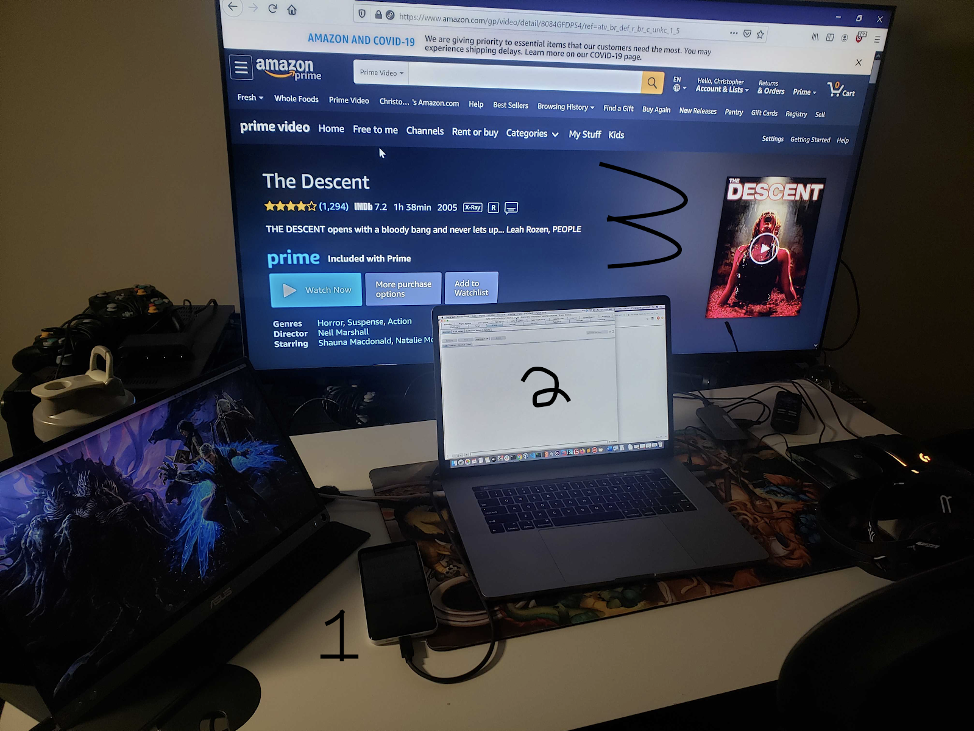
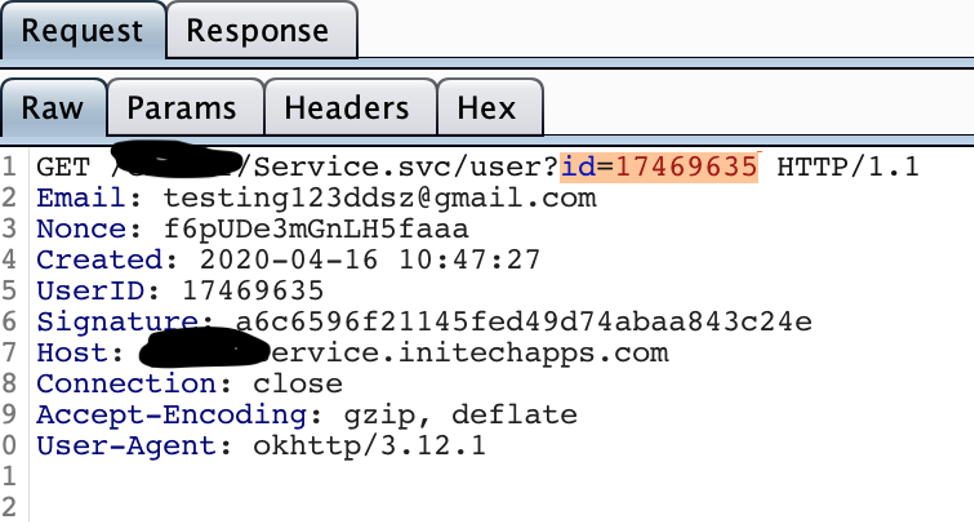
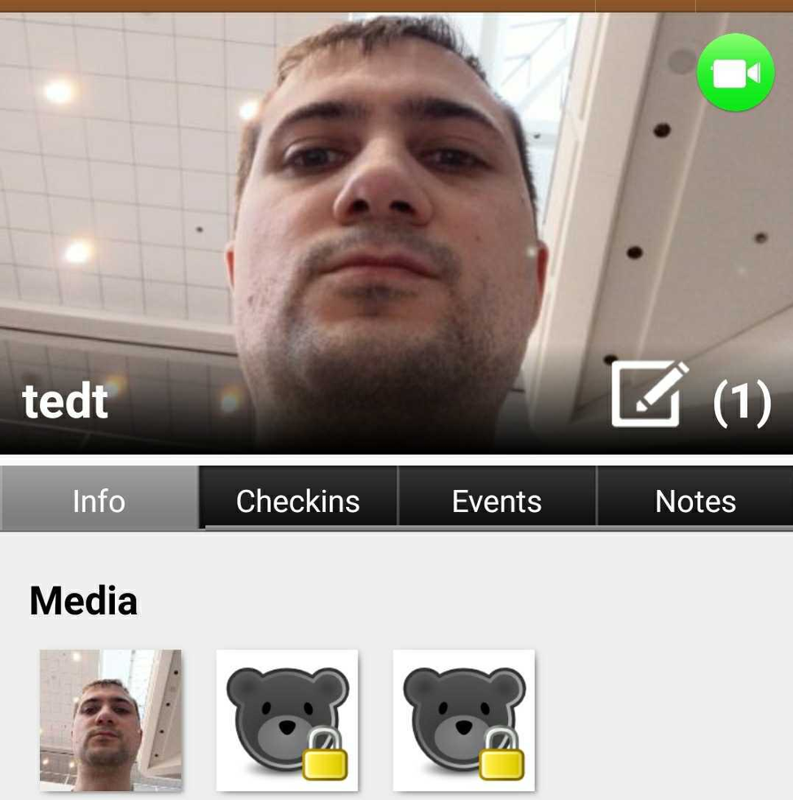
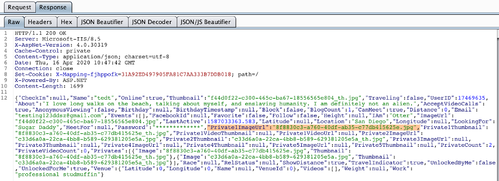
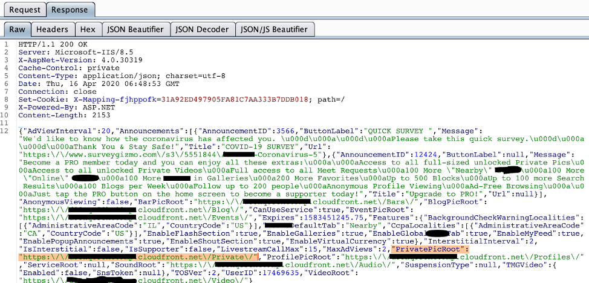

+++
date = "2020-04-16"
title = "Insecurity Through (not very) Obscurity"
slug = "IDOR"
tags = [
]
categories = [
]
externalLink = ""
series = []
+++
*Hello.*

I am conducting security research into dating and encounter apps because I want to see how the latest and greatest of them handle their users’ privacy. Bugs and vulnerabilities that I may or may not have found in the wild will first appear in a hypothetical post in this blog. Once these things that may or may not exist have been disclosed, a more thorough write-up will occur elsewhere. 

For now, I’m just trying to gracefully relate what I do on the daily to my friends and family.

So let’s steal some n00dz (no n00dz were harmed in the making of this blogpost).

To begin, I’d like to show you my setup to provide some sense of what I look like when I work. Here’s my home “office”.

1. I do stuff on the phone application. Whether it’s pressing buttons, logging in, updating profile information, or anything else in the app, it will usually send a message out to the application’s servers somewhere in the internet. It is the application server’s job to process that message and respond with another message that will be returned to the phone, usually indicating that whatever I tried to do was successful.

2. My laptop, with the Burp Suite proxy open. A proxy is a way to intercept messages that are going to and from the phone. Before going out to the application server, the messages to and from my phone must pass through my proxy, where I will be able to read and modify the messages. This is important because it allows whoever is in control of the proxy to send and receive these message in ways that the application engineer did not intend.

3. Represented here by the TV that I have set up too close to (don’t worry, I’m rarely watching it, I just like to have horror movies on while I work) is the public internet and the application servers. Messages that I have read or modified in my proxy will then be passed to the application servers which exist across the public internet. When the servers respond to my phone, their message must travel in reverse, passing through my proxy (2) again before they return to my phone (1).

Next, I will establish context for what I was looking for when I found this vulnerability that allowed me to steal private pictures in this application. Unfortunately, developer oversight and market incentives lead to three very common weaknesses in a lot of applications. Those weaknesses include....

####Weakness A: Reliance on Certificate Pinning to Ensure Messages Aren’t Modified in Transit. 

Basically, my phone will check on traffic that it thinks is returned from the application servers for an unguessable “certificate”.  If the message does not bear the proper certificate, then my phone will not establish a connection to the app servers and won’t interact with them. This is obviously bad for research because this means I can’t view and modify traffic normally in my proxy, as messages returned from my proxy to the phone will have a certificate from my proxy, and not from the application servers.

This is an important protection that can shield users from malicious interception or modification by an attacker who has control of a router that relays their traffic on the internet, but does not protect the application server from a user bypassing the certificate pinning to modify messages themselves. Unfortunately, some developers suffer the misconception that this can be used to prevent users from fiddling with their app locally. I’ve bypassed this using the Frida framework. More details on that can be found [here](https://medium.com/@ved_wayal/hail-frida-the-universal-ssl-pinning-bypass-for-android-e9e1d733d29). Because this is more advanced, I won’t be discussing this further in this post.

#### Weakness B: Market Incentives for a Streamlined User Experience. 

Users don’t like to be kept waiting, and what’s more annoying than having to wait a full second for a server response with a spinning “loading” icon in your application every time you do...anything? Wouldn’t it be so much faster and easier if the phone had all the information it needed to do 99% of most application operations on its own, even privacy-sensitive operations like fetching private pictures? Surely nobody would expose this information and abuse it if it was sent to the phone ;)

#### Weakness C: Security Through Obscurity. 

*Oh damn, first death scene in The Descent. Brutal.* 

Okay, so let’s imagine that you stored your private picture somewhere on the internet on a server. The server would readily cough up your picture to anyone who asked, as long as they asked for exactly the right picture. Now, let’s assume your picture was just called 37.jpg. That’d be pretty terrible. Anyone who came along and asked for pictures 1.jpg through 50.jpg would wind up with your picture, too!

Ok, but what if your picture was called **8f8830c3-a760-40df-ab35-c77db415625e.jpg**? 

That’s a lot of hexadecimal. If someone was just trying to guess that, iterating through every possible number or letter in every position, it’d probably take them a bazillion years (I did the math). Who has time to wait for that when you’re starting at 00000000-0000-0000-0000-000000000000.jpg? 

So you can see what I mean by security through obscurity. Technically, anyone can access this picture if they just happen to guess it. But doing that is virtually impossible. It’d only be a problem if the ID of the picture got exposed somehow, right? Hmmmm ;)

### The Vulnerability

So, as I was pushing buttons in the application, I noticed the following messages were being intercepted in my proxy when viewing other user profiles inside the app. For example, when I touched someone’s profile picture in an attempt to view their bio, this happened. 

Interesting. See the “**id=17469635**” on line #1? That’s my phone telling the application server which picture I clicked on. The server will look for the bio associated with that ID, and return it to me.

So, for example, if I clicked on that picture, we’d see this ugly mug.
 

Nice. One public profile pic, but some locked “private” media that isn’t visible to the general public. What response does our phone see from the application server?

Oh my, that’s a good deal more information than we bargained for. Full ID’s for all images both public and private (highlighted an example). But wait, don’t we need to know the beginning of the URL to call, or is that...

Oh, great. The “PrivatePicRoot” is given to us in a helpful message about COVID-19. We see a **XXXXXXXXXX.cloudfront.net/Private/**. I wonder what happens if I append a private picture ID to that?

Great googly moogly! My private pics really bring out my eyes.

That’s all for now. I’ll post again when I find something serious in another app. I’ve got some good ones coming down the line (dating for rich people, meetups for 3-ways, Norm McDonald apparently has a new app for Coronavirus quarantine dating…)

*Goodbye.*
